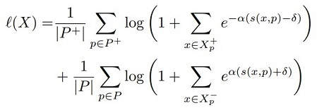

# dml-tf
Distance Metric Learning, TensorFlow v2 implementation.  
This project includes:  
1. ProxyNCA (The implementation in this repository is more stable and produces better results than original paper.)  
2. ProxyAnchor  

## Python Packages
1. tensorflow-v2.4.0  
2. tensorflow-addons  
3. numpy  

## How To Use
Before you train, configure train/config.py.  
```
git clone https://github.com/shi510/dml-tf
cd dml-tf
export PYTHONPATH=$PYTHONPATH:$(pwd)
python train/main.py
```

## What's Different from existing github implementations?

1. Additional Loss on Proxy Vector (Orthogonal Loss)  
The additional loss regularizes that all proxies are perpendicular to each other.  
It converges faster when this orthogonal loss is added.  
See [train/loss/utils.py](train/loss/utils.py) and [train/custom_model.py](train/custom_model.py).  
The orthogonal loss can be writen for simplicity as below:  
```python
self_dist = matmul(proxies, proxies.T)
ortho_loss = pairwise_distance(self_dist, I) # where I is an identity matrix.
ortho_loss = mean(ortho_loss) / 2. # remove the other triangular part.
total_loss = proxy_loss + ortho_loss * λ # where the λ is [0, 1].
```
But it need to implement cutom operator in efficient way because of memory usage when the number of proxies is large.  
The sum_uppertri_square_dot(P) is same with sum(uppertri(square(matmul(P, P^T)))), but excluding diagonal part.  
The diag_part_dot(P) is same with diag_part(matmul(P, P^T)).  
```python
uppertri_sum = sum_uppertri_square_dot(P)
diag = diag_part_dot(P)
diag_sum = sum(square(1. - diag))
ortho_loss = uppertri_sum + diag_sum
total_loss = proxy_loss + ortho_loss * λ
```
See the comparisons on varying in λ (batch_size=64, embedding_dims=64, x-axis is epoch).  
The biggest gap is about 10%.  


Orthogonality between each proxies is close to zero (non diagonal part) as epoch and lambda increase.  


2. ProxyNCA Loss  
  
ProxyNCA loss can be calculated by tf.nn.log_softmax.  
But we can not use the function directly because we should seperate positive and negative proxy distances.  
Also we should consider numerical stability of our log_softmax implementation.  
So, we can rewrite `negative log_softmax=-log(exp(a)/sum(exp(b)))=log(sum(exp(b)))-a`.  
See [train/loss/proxynca.py](train/loss/proxynca.py).  

3. ProxyAnchor Loss  
  
ProxyAnchor loss can be calculated by tf.math.reduce_logsumexp.  
As the same issues on proxyNCA Loss, we can not use the function directly.  
So, this project re-implements the reduce_logsumexp seperating positive and negative proxy distances.  
The function can be rewriten as below for numerical stability:  
`logsumexp(x) = c + log(sum(exp(x-c))), where c is a maximum of x.`  
See [train/loss/proxyanchor.py](train/loss/proxyanchor.py).  

## Training Conditions
1. Augmentation: random_flip, random_color, random_cutout  
2. Random Crop: All images are resized by 256x256 and then random crop by 224x224.  
3. Scale Factors: `this is very important. (Depending on your dataset size)`  
4. All network should be pretrained by imagenet, `this is important.`  

## Results of `ProxyNCA` on Test Set
|                 | CUB         | cars196     | InShop      | SOP         |
|-----------------|-------------|-------------|-------------|-------------|
| NMI             | 73%         | 70%         | 87%         | 88%         |
| Recall @ 1      | 71%         | 81%         | 83%         | 69%         |
| Recall @ 2      | 78%         | 86%         | 88%         | 74%         |
| Recall @ 4      | 82%         | 89%         | 91%         | 79%         |
| Recall @ 8      | 85%         | 91%         | 94%         | 83%         |
| Epoch           | 19          | 18          | 25          | 16          |
| Arch.           | InceptionV3 | InceptionV3 | InceptionV3 | InceptionV3 |
| Batch Size      | 64          | 64          | 64          | 64          |
| Embedding Size  | 64          | 64          | 64          | 64          |
| Scale           | 32          | 32          | 32          | 32          |
| Weight Opt      | AdamW@1e-4  | AdamW@1e-4  | AdamW@1e-4  | AdamW@1e-4  |
| Proxy Opt       | AdamW@1e-2  | AdamW@1e-2  | AdamW@1e-2  | AdamW@1e-2  |

## Results of `ProxyAnchor` on Test Set
|                 | CUB         | cars196     | InShop      |
|-----------------|-------------|-------------|-------------|
| NMI             | 71%         | 70%         | 87%         |
| Recall @ 1      | 71%         | 82%         | 81%         |
| Recall @ 2      | 78%         | 86%         | 87%         |
| Recall @ 4      | 82%         | 89%         | 91%         |
| Recall @ 8      | 85%         | 90%         | 94%         |
| Epoch           | 20          | 18          | 15          |
| Arch.           | InceptionV3 | InceptionV3 | InceptionV3 |
| Batch Size      | 64          | 64          | 64          |
| Embedding Size  | 64          | 64          | 64          |
| Scale           | 32          | 32          | 32          |
| Weight Opt      | AdamW@1e-4  | AdamW@1e-4  | AdamW@1e-4  |
| Proxy Opt       | AdamW@1e-2  | AdamW@1e-2  | AdamW@1e-2  |

## TODO LIST
- [x] *Known as `Proxy-NCA`*, No Fuss Distance Metric Learning using Proxies, Y. Movshovitz-Attias et al., ICCV 2017
- [ ] Correcting the Triplet Selection Bias for Triplet Loss, B. Yu et al., ECCV 2018
- [ ] SoftTriple Loss: Deep Metric Learning Without Triplet Sampling, Q. Qian et al., ICCV 2019
- [ ] Multi-Similarity Loss with General Pair Weighting for Deep Metric Learning, X. Wang et at., CVPR 2019
- [x] Proxy Anchor Loss for Deep Metric Learning, S. Kim et al., CVPR 2020
- [ ] ProxyNCA++: Revisiting and Revitalizing Proxy Neighborhood Component Analysis, E. W. Teh et al., ECCV 2020

## References
1. [pytorch impl: https://github.com/dichotomies/proxy-nca](https://github.com/dichotomies/proxy-nca)
